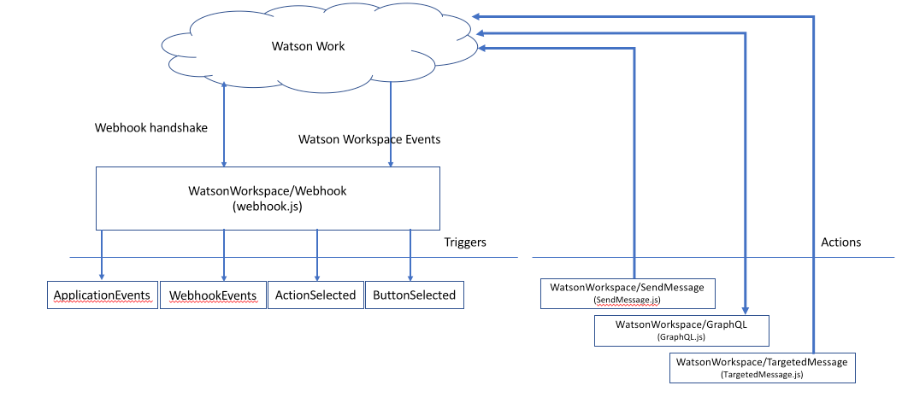

# WWCloudFunctions  

To get started you might want to create a new space in your organization. Here are some steps you can use to prepare for deploying this application. This is optional, if you already have a space you want to use simple use the [Bluemix CLI](https://console.bluemix.net/docs/cli/reference/bluemix_cli/get_started.html#getting-started) to set your target. Having a new space gives you a new IBM Cloud Functions namespace to work in; think of it as your project work area.
- Install [Cloud Functions CLI](https://console.bluemix.net/openwhisk/learn/cli)
- To create a new space run
  - `bx cf create-space WatsonWorkspace`
- It will return a `cf` command to set your target to your new space. You'll just want to replace `cf` with `bx`.

You can use the [Dumper](samples/Dumper) deployment to assist in your application development. It creates simple functions that just dump their input contents to a log. This is useful for understanding the events that are being published by this application.

## Sample applications
- [**Invitation Command**](samples/InviteCommand) - An example application which handles an invitation command from the user and allows them to invite any member of the space to an event.
- [**Weather Bot**](samples/Weather) - An app that leverages the Watson cognitive capabilities of Watson Work to be able to give weather conditions and forecasts.

## Deployment
You can deploy this code using a number of different methods. I've provided instructions for the following:
- [**Using the CLI**](#basic-webhook-and-event-topic-deployment) - you can use this to gail familiarity with IBM Cloud Functions and the CLI itself.
- [**Using wskdeploy**](#wskdeploy-deployment) - You can also use `wskdeploy` to get simple single command (almost!) deployment.

### Basic Webhook and Event Topic Deployment
The code for the template is located [here](runtimes/nodejs). To create a very basic application, one that will simple recieve events from Watson Workspace and make them available to IBM Cloud Functions via a trigger follow these steps:
- Create your application in [Watson Workspace Developer](https://developer.watsonwork.ibm.com/apps)> Be sure to copy your Application ID and Application Secret.
- Edit the the PackageParameters.json file with your app's values. For now just put in your Application ID and Secret; we'll add to it later with the Webhook Secret.
- Next you'll want to create the package for the Watson Workspace actions along with parameters for your Watson Workspace App information
  - `bx wsk package create WatsonWorkspace -P PackageParameters.json`
  - if you need to change any of the values simply run
    - `bx wsk package update WatsonWorkspace -P PackageParameters.json`
- Create the main WebHook action
  - `bx wsk action create WatsonWorkspace/Webhook Webhook.js --web raw --kind nodejs:8`
- Get the Web Action URL
  - `bx wsk action get WatsonWorkspace/Webhook --url`
- Paste this into your App as your Webhook URL. NOTE: URL decode any coding (e.g. change %40 => @). Add the Webhook Secret to your PackageParmeters.json and update with
  - `bx wsk package update WatsonWorkspace -P PackageParameters.json`.
- Deploy the GraphQL function
  - `bx wsk action create WatsonWorkspace/GraphQL GraphQL.js --kind nodejs:8`
- Create the triggers for the events.
  - `bx wsk trigger create WWApplicationEvents`
  - `bx wsk trigger create WWWebhookEvents`
  - `bx wsk trigger create WWActionSelected`
  - `bx wsk trigger create WWButtonSelected`

### Complete Application Framework
This example also includes IBM Cloud Functions for sending messages and running GraphQL commands for more advanced applications. To deploy those follow these steps:
- First deploy the WWToken action
  - `bx wsk action create WatsonWorkspace/Token Token.js --kind nodejs:8`
- To deploy the SendMessage function run
  - `bx wsk action create WatsonWorkspace/SendMessage SendMessage.js --kind nodejs:8`
- To deploy the TargetedMessage function
  - `bx wsk action create WatsonWorkspace/TargetedMessage TargetedMessage.js --kind nodejs:8`

## Wskdeploy deployment
**wskdeploy** provides a simple way to deploy your apps. You define a manifest using standard YAML notation, and then use the `wskdeploy` application to deploy it. You can read more about [**wskdeploy**](https://github.com/apache/incubator-openwhisk-wskdeploy). To install, simply download the current version from the [release folder](https://github.com/apache/incubator-openwhisk-wskdeploy/releases).
Once installed you can install all the functions and triggers in the basic example you simply:
- Change directory to the [template runtime](runtimes/nodejs)
- Set the following environment variables from your Watson Workspace Application:
- - WW_APP_ID - Application ID.
- - WW_APP_SECRET - Application Secret.
- - WW_WEBHOOK_SECRET - Webhook Secret.
- run `wskdeploy` - this will deploy everything in the [manifest](runtimes/nodejs/Manifest.yml) in this directory.
- Get the Web Action URL
  - `bx wsk action get WatsonWorkspace/Webhook --url`
- Paste this into your App as your Webhook URL. NOTE: URL decode any coding (e.g. change %40 => @).

Once installed you will have the entire template installed and configured. Plus a simple [Echo App](runtimes/nodejs/Echo.js) that you can use as a starting point for your app.

That's it. You will have everything you need already deployed and configured.

